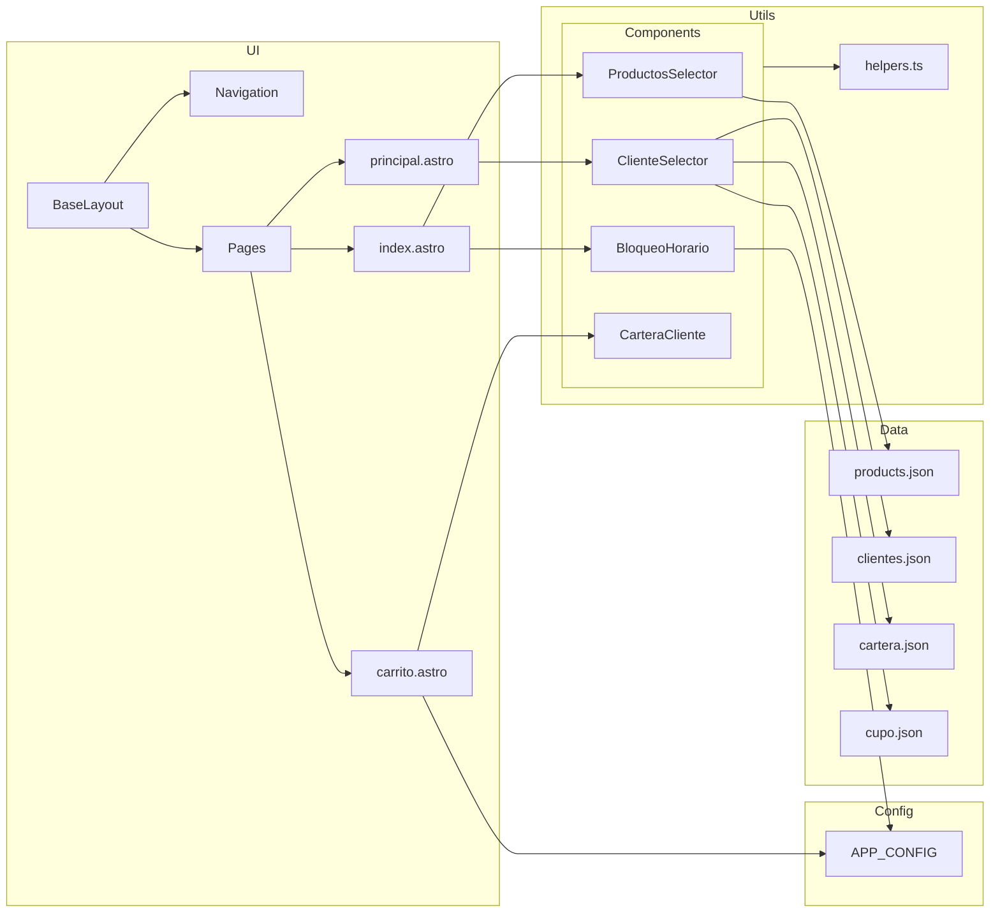

## 07. Diagramas

### Flujo principal de usuario

```mermaid
flowchart TD
    A[Inicio /] --> B{Horario de atención}
    B -- No --> BH[Componente BloqueoHorario]
    B -- Sí --> C[Ver catálogo de productos]
    C --> D[Agregar productos al carrito (localStorage.cartItems)]
    D --> E[Ir a Selección de Cliente /principal]
    E --> F[Buscar y seleccionar cliente]
    F --> G[Persistir datosCliente en localStorage]
    G --> H[Ir a Carrito /carrito]
    H --> I{Cliente con cupo?}
    I -- Sí --> J[Construir mensaje de pedido]
    I -- No --> K[Construir mensaje de alerta sin cupo]
    J --> L[Abrir enlace WhatsApp y enviar]
    K --> L[Abrir enlace WhatsApp y enviar]
    L --> M[Vaciar carrito y limpiar datosCliente]
```

### Arquitectura de módulos



Nota: Para visualizar los diagramas en GitHub/GitLab, asegúrate de que el visor soporte Mermaid. De lo contrario, exporta a imagen con herramientas externas.

