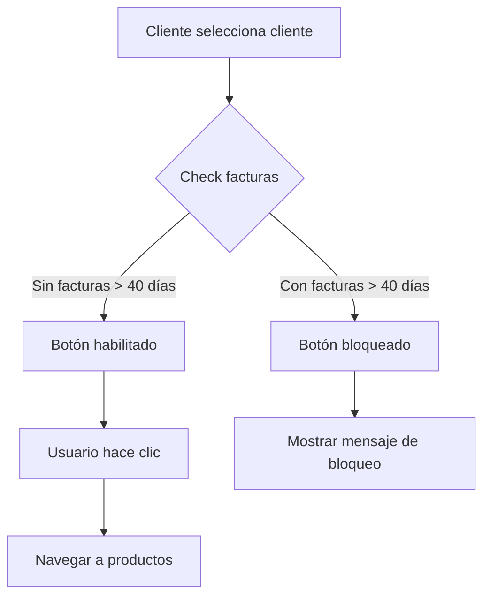

# Arquitectura Atomic Design - Pedido Sura Web

## 📋 Introducción

Este documento describe la arquitectura de componentes basada en la metodología **Atomic Design** implementada en el proyecto Pedido Sura Web. Esta aproximación organiza los componentes de la interfaz de usuario en una jerarquía clara que promueve la reutilización, mantenibilidad y escalabilidad.

## 🏗️ Estructura Jerárquica

### Niveles de Atomic Design

```
┌─────────────────────────────────────────────────────────────┐
│                        PAGES                               │
│  • index.astro                                             │
│  • carrito.astro                                           │
│  • producto.astro                                          │
└─────────────────────┬───────────────────────────────────────┘
                      │
┌─────────────────────────────────────────────────────────────┐
│                      TEMPLATES                              │
│  • ClienteSelectorTemplate.astro                           │
│  • ProductosTemplate.astro                                 │
└─────────────────────┬───────────────────────────────────────┘
                      │
┌─────────────────────────────────────────────────────────────┐
│                     ORGANISMS                               │
│  • ClienteSelector.astro                                   │
│  • ProductosSelector.astro                                 │
│  • BloqueoHorario.astro                                    │
└─────────────────────┬───────────────────────────────────────┘
                      │
┌─────────────────────────────────────────────────────────────┐
│                    MOLECULES                                │
│  • SearchInput.astro                                       │
│  • ClienteResults.astro                                    │
│  • CupoInfo.astro                                          │
│  • CarteraTable.astro                                      │
│  • ClienteInfo.astro                                       │
│  • SucursalList.astro                                      │
└─────────────────────┬───────────────────────────────────────┘
                      │
┌─────────────────────────────────────────────────────────────┐
│                      ATOMS                                  │
│  • Button.astro                                            │
│  • Input.astro                                             │
│  • StatusBadge.astro                                       │
│  • Icon.astro                                              │
└─────────────────────────────────────────────────────────────┘
```

## 🔍 Descripción de Niveles

### 1. Átomos (Atoms)

**Los componentes más básicos e indivisibles**

#### Button.astro

- **Propósito**: Elemento de interacción básico
- **Props principales**:
  - `variant`: 'primary' | 'secondary' | 'danger' | 'blocked' | 'success'
  - `size`: 'sm' | 'md' | 'lg'
  - `disabled`: boolean
  - `loading`: boolean
- **Uso**:

```astro
<Button variant="primary" size="md">Continuar</Button>
<Button variant="blocked" disabled={true}>Cliente bloqueado</Button>
```

#### Input.astro

- **Propósito**: Campo de entrada de texto
- **Props principales**:
  - `type`: 'text' | 'email' | 'password' | 'number' | 'search'
  - `placeholder`: string
  - `label`: string
  - `error`: string
  - `required`: boolean
- **Uso**:

```astro
<Input
  type="text"
  placeholder="Buscar cliente..."
  label="Nombre del cliente"
  required={true}
/>
```

#### StatusBadge.astro

- **Propósito**: Indicador de estado con colores
- **Props principales**:
  - `status`: 'success' | 'warning' | 'danger' | 'info' | 'blocked'
  - `size`: 'sm' | 'md' | 'lg'
- **Uso**:

```astro
<StatusBadge status="success">Con Cupo</StatusBadge>
<StatusBadge status="danger">SIN CUPO</StatusBadge>
```

#### Icon.astro

- **Propósito**: Iconos visuales estandarizados
- **Props principales**:
  - `name`: nombre del ícono
  - `size`: 'sm' | 'md' | 'lg' | 'xl'
  - `color`: string
- **Uso**:

```astro
<Icon name="search" size="sm" />
<Icon name="warning" size="md" color="#dc3545" />
```

### 2. Moléculas (Molecules)

**Combinaciones de átomos que forman unidades funcionales**

#### SearchInput.astro

- **Propósito**: Campo de búsqueda con ícono
- **Componentes**: Input + Icon
- **Uso**:

```astro
<SearchInput
  placeholder="Buscar por nombre o ID del cliente..."
  value={busqueda}
  onInput={handleSearch}
/>
```

#### CupoInfo.astro

- **Propósito**: Información del cupo del cliente
- **Componentes**: StatusBadge + Icon
- **Uso**:

```astro
<CupoInfo
  cupoDisponible={cupoDisponible}
  totalCartera={totalCartera}
  sinCupo={sinCupo}
/>
```

#### CarteraTable.astro

- **Propósito**: Tabla de facturas del cliente
- **Componentes**: StatusBadge + Icon
- **Uso**:

```astro
<CarteraTable
  cartera={carteraCliente}
  totalCartera={totalCartera}
  isLoading={isLoading}
/>
```

### 3. Organismos (Organisms)

**Combinaciones de moléculas y átomos que forman secciones completas**

#### ClienteSelector.astro (React)

- **Propósito**: Organismo completo para selección de clientes
- **Incluye**: SearchInput, ClienteResults, CupoInfo, CarteraTable, etc.
- **Funcionalidad**: Maneja toda la lógica de negocio para selección de clientes

### 4. Plantillas (Templates)

**Estructuras de página que organizan los organismos**

#### ClienteSelectorTemplate.astro

- **Propósito**: Plantilla completa para la página de selección de clientes
- **Incluye**: Header, SearchInput, ClienteInfo, CupoInfo, CarteraTable, SucursalList
- **Uso**:

```astro
<ClienteSelectorTemplate
  busqueda={busqueda}
  clienteSeleccionado={clienteSeleccionado}
  resultados={resultados}
  cupoDisponible={cupoDisponible}
  totalCartera={totalCartera}
  carteraCliente={carteraCliente}
  onSearchChange={handleSearchChange}
  onClienteSelect={handleClienteSelect}
  onContinue={handleContinue}
/>
```

### 5. Páginas (Pages)

**Instancias específicas de plantillas con contenido real**

#### index.astro

- **Propósito**: Página principal del catálogo de productos
- **Incluye**: BaseLayout + ClienteSelectorTemplate
- **Ruta**: `/`

## 🎯 Funcionalidad de Bloqueo por Deudas

### Lógica de Verificación

```typescript
// Utilidad para verificar facturas vencidas
import {
  tieneFacturasVencidas,
  obtenerFacturasVencidas,
} from "../utils/atomic-design/deudaUtils";

// Verificación en el componente
const clienteBloqueado = tieneFacturasVencidas(clienteSeleccionado, 40);
```

### Estados del Botón

| Condición                      | Estado        | Texto                           | Acción                   |
| ------------------------------ | ------------- | ------------------------------- | ------------------------ |
| Cliente sin facturas vencidas  | Habilitado    | "Continuar al Producto"         | Navegar a productos      |
| Cliente con facturas > 40 días | Bloqueado     | "Cliente bloqueado por factura" | Mostrar mensaje de error |
| Cliente sin seleccionar        | Deshabilitado | "Continuar al Producto"         | Ninguna                  |

### Flujo de Verificación



## 🎨 Sistema de Diseño

### Paleta de Colores

```css
/* Estados de riesgo */
--color-success: #28a745;
--color-warning: #ffc107;
--color-danger: #dc3545;
--color-info: #17a2b8;
--color-blocked: #dc3545;

/* Colores de interfaz */
--color-primary: #4caf50;
--color-secondary: #6c757d;
--color-background: #f8f9fa;
--color-surface: #ffffff;
```

### Espaciado Consistente

```css
/* Sistema de espaciado */
--space-xs: 0.25rem;
--space-sm: 0.5rem;
--space-md: 1rem;
--space-lg: 1.5rem;
--space-xl: 2rem;
--space-2xl: 3rem;
```

### Tipografía

```css
/* Jerarquía tipográfica */
--font-family: -apple-system, BlinkMacSystemFont, "Segoe UI", "Roboto",
  sans-serif;
--font-size-xs: 0.75rem;
--font-size-sm: 0.875rem;
--font-size-base: 1rem;
--font-size-lg: 1.125rem;
--font-size-xl: 1.25rem;
```

## 🔧 Utilidades de Deuda

### Funciones Principales

```typescript
// Verificar si cliente tiene facturas vencidas
tieneFacturasVencidas(cliente, diasLimite = 40): boolean

// Obtener facturas vencidas
obtenerFacturasVencidas(cliente, diasLimite = 40): Factura[]

// Calcular total de deuda vencida
calcularDeudaVencida(cliente, diasLimite = 40): number

// Obtener estado de riesgo del cliente
obtenerEstadoRiesgoCliente(cliente): 'bajo' | 'medio' | 'alto' | 'bloqueado'
```

### Ejemplo de Uso

```typescript
import {
  tieneFacturasVencidas,
  calcularDeudaVencida,
  formatearMoneda,
} from "../utils/atomic-design/deudaUtils";

// En componente React
const cliente = {
  id: 12345,
  nombre: "Cliente Ejemplo",
  cartera: [
    { fac: "001", valor: "1000000", dias: 45 },
    { fac: "002", valor: "500000", dias: 15 },
  ],
};

const estaBloqueado = tieneFacturasVencidas(cliente, 40); // true
const deudaTotal = calcularDeudaVencida(cliente, 40); // 1000000
const mensaje = formatearMoneda(deudaTotal); // $1,000,000
```

## 📱 Responsive Design

### Breakpoints

```css
/* Mobile First */
@media (max-width: 480px) {
  /* Móviles pequeños */
}
@media (max-width: 768px) {
  /* Tablets */
}
@media (max-width: 1024px) {
  /* Desktop pequeños */
}
@media (min-width: 1025px) {
  /* Desktop grandes */
}
```

### Estrategias

1. **Mobile First**: Diseño base para móviles, mejoras progresivas
2. **Grid Flexible**: Uso de CSS Grid y Flexbox para layouts adaptables
3. **Touch Targets**: Botones mínimos de 44px para mejor usabilidad táctil
4. **Contenido Prioritario**: Información más importante visible primero

## 🚀 Buenas Prácticas

### Organización de Archivos

```
src/
├── components/
│   ├── atoms/           # Componentes básicos
│   ├── molecules/       # Combinaciones de átomos
│   ├── organisms/       # Secciones completas
│   ├── templates/       # Estructuras de página
│   └── pages/          # Páginas específicas
├── styles/
│   ├── atoms/          # Estilos de átomos
│   ├── molecules/      # Estilos de moléculas
│   └── organisms/      # Estilos de organismos
└── utils/
    └── atomic-design/  # Utilidades de negocio
```

### Nomenclatura

- **Archivos**: `PascalCase` para componentes, `camelCase` para utilidades
- **Clases CSS**: `BEM` methodology (Block\_\_Element--Modifier)
- **Variables**: `--nombre-variable` para propiedades CSS personalizadas

### Accesibilidad

- **ARIA Labels**: Todos los componentes interactivos tienen labels apropiados
- **Keyboard Navigation**: Soporte completo para navegación por teclado
- **Screen Readers**: Textos descriptivos y roles semánticos
- **Color Contrast**: Cumple con estándares WCAG 2.1 AA

## 🔄 Mantenimiento y Evolución

### Agregar Nuevos Componentes

1. **Átomos**: Crear en `src/components/atoms/`
2. **Moléculas**: Combinar átomos existentes o crear nuevos
3. **Organismos**: Usar moléculas para crear secciones funcionales
4. **Plantillas**: Estructurar páginas usando organismos
5. **Actualizar Documentación**: Mantener diagramas y guías actualizadas

### Mejores Prácticas

- ✅ **DRY (Don't Repeat Yourself)**: Reutilizar componentes existentes
- ✅ **SOLID Principles**: Cada componente tiene una responsabilidad única
- ✅ **Composición**: Preferir composición sobre herencia
- ✅ **Props Interface**: Definir claramente las interfaces de componentes
- ✅ **Testing**: Cada componente debe ser testeable independientemente

## 📋 Checklist de Implementación

- [x] Estructura de directorios Atomic Design
- [x] Componentes atómicos básicos (Button, Input, StatusBadge, Icon)
- [x] Componentes moleculares funcionales
- [x] Plantillas de página organizadas
- [x] Lógica de bloqueo por deudas implementada
- [x] Utilidades de deuda centralizadas
- [x] Documentación completa y actualizada
- [x] Responsive design implementado
- [x] Accesibilidad garantizada
- [ ] Testing unitario para componentes
- [ ] Testing de integración para flujos completos

---

_Este documento se mantiene actualizado con cada cambio en la arquitectura del proyecto._
